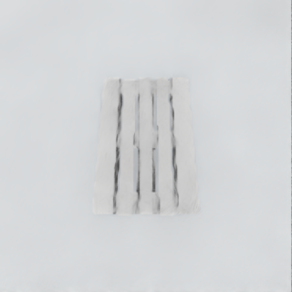
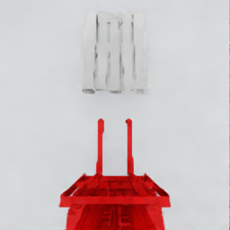

# 物理环境重大修正：视觉盲区消除与渲染性能权衡分析 (2026-03-15)

## 0. 修正背景与意义
在经历了长达一周的实验（从 Exp 3 到 Exp 6）后，我们始终被模型在最后插入阶段的“推土机”行为所困扰。虽然我们尝试了各种复杂的奖励函数（轨迹引导、死区惩罚、动态退火等），但效果始终治标不治本。

本次修正跳出了“算法调参”的思维定势，回归到**物理环境和传感器配置**的本源，发现了导致模型失败的两个致命的底层物理/渲染 Bug：
1. **相机的物理盲区**导致模型在关键阶段“失明”。
2. **Headless 渲染降级**导致目标物体（货叉）与背景融为一体，模型无法提取有效特征。

这次修正不仅是 Exp 7 的起点，更是整个视觉 RL 训练框架走向成熟的关键转折点。

## 1. 核心发现：60度视角的致命盲区

在之前的实验（Exp 5.x, Exp 6.0b）中，模型在接近托盘的最后阶段频繁出现“推土机”行为（即无法精准判断插入深度，直接推着托盘走）。

经过可视化排查，发现根本原因在于**相机俯仰角 (Pitch) 设置存在物理盲区**。

*   **旧配置 (Pitch = 60°)**：相机的视野（FOV）下边缘刚好“切”掉了货叉根部区域。当托盘被推到货叉根部（即即将完全插入）时，托盘会从画面下方**完全消失**。
*   **后果**：模型在最后几厘米的关键冲刺阶段变成了“瞎子”，只能依靠本体感觉（proprioception）盲猜，导致无法精准停止，从而产生推盘行为。

**调整前的问题演示 (60度视角)：**
<video src="../images/camera_60deg_blind_spot.mp4" controls width="400"></video>
*视频1：在 60度 视角下，当叉车接近并插入托盘时，托盘在最后阶段突然从画面下方消失，导致模型失去视觉目标。*

### 解决方案：调整为 75度
将相机的俯仰角从 60° 调整为 **75°**。
```python
camera_rpy_local_deg: tuple[float, float, float] = (0.0, 75.0, 0.0)
```
**效果**：通过动态视频验证，75度视角下，相机的视野能够完整覆盖整个货叉以及插入到底的托盘。托盘在整个插入过程中始终保持在视野内，彻底消除了视觉盲区。

**调整后的效果演示 (75度视角)：**
<video src="../images/camera_75deg_no_blind_spot.mp4" controls width="400"></video>
*视频2：在 75度 视角下，叉车在整个接近和插入过程中，货叉根部和托盘始终清晰可见，消除了盲区。*


*图1：75度俯仰角下，即使托盘插到底部，依然清晰可见。（注：此图为未加载完整材质时的静态截图，由于光照原因，黑色货叉与地面融合，容易产生视觉错觉，这也是我们后续需要修改渲染颜色的原因。）*

---

## 2. 渲染机制揭秘：为什么训练图像看起来像“灰度图”？

在排查过程中，我们提取了神经网络在训练时真正接收到的图像张量（Tensor），发现画面极其简陋，物体只有黑、白、灰三种颜色，且货叉（黑色）与地面（深灰色）几乎融为一体。

### 2.1 现象背后的原因：性能与保真度的妥协
这并非 Bug，而是大规模并行视觉 RL 训练中普遍存在的**工程妥协**。

1.  **Headless 模式下的渲染降级**：为了在单卡上支撑 64 个环境并行，并达到每秒几百步的极高吞吐量，IsaacLab 的底层渲染器（RTX Real-Time）在 `headless=True` 模式下会主动丢弃复杂的光线追踪、阴影和高光反射。
2.  **材质加载策略 (`wait_for_textures = False`)**：为了防止仿真启动时因等待高清贴图（如木纹）加载而导致进程挂起或崩溃，我们主动禁用了贴图等待。这导致托盘变成了默认的纯白色，地面变成了深灰色。
3.  **对比度缺失**：在缺乏光照和材质的情况下，黑色的货叉和深灰色的地面在低分辨率（256x256）下像素值极为接近。这导致神经网络极难从背景中分割出“货叉”这一关键本体，进一步加剧了对齐的难度。

### 2.2 解决方案：强制材质覆盖（Color Override）
为了让网络不再当“瞎子”，我们不能指望恢复极其耗算力的高清渲染。相反，我们采取了最简单粗暴但极其有效的方案：**给货叉涂上高对比度的颜色**。

在 `env_cfg.py` 中，强制将叉车的材质覆盖为**亮红色**：
```python
visual_material=sim_utils.PreviewSurfaceCfg(
    diffuse_color=(1.0, 0.0, 0.0),  # 强制亮红色
    metallic=0.5,
    roughness=0.5,
)
```
**效果**：现在，红色的货叉、白色的托盘、灰色的地面形成了极其强烈的色彩对比。神经网络可以毫不费力地识别出自身（货叉）和目标（托盘）的相对位置。


*图2：Headless 模式下网络真正接收到的图像。虽然缺乏光照和纹理，但亮红色的货叉与背景形成了极高的对比度。*

### 2.3 关于 Sim2Real 的长远思考
您可能会问：如果模型只认识“红色的货叉”，到了真实世界看到黑色的货叉怎么办？

*   **当前阶段（Exp 7.1）**：我们的首要目标是验证“在没有盲区且目标清晰的情况下，算法能否学会完美的插入逻辑”。因此，使用红色货叉是加速收敛的合理手段。
*   **未来阶段（Sim2Real）**：在模型掌握了核心动作逻辑后，我们必须引入**域随机化（Domain Randomization）**。在训练的后期，我们会让货叉的颜色、地面的颜色、光照的方向和强度在每一回合都随机变化。这会强迫神经网络去学习物体的**几何形状特征**，而不是死记硬背颜色，从而最终实现向真实世界的无缝迁移。
