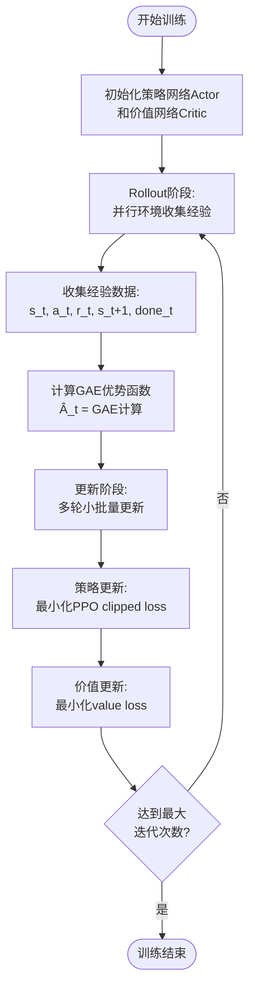

# 强化学习组成单元与整体思路

本页适合：想系统理解本项目强化学习基本组成单元（输入、输出、奖励、价值函数、目标函数等）以及PPO算法整体训练思路的读者。

---

## 1. 强化学习基本组成单元

### 1.1 输入（观测空间）

**观测维度**：13维向量

策略网络每一步接收的观测向量包含以下信息：

| 维度 | 名称 | 含义 | 计算方式 |
|------|------|------|----------|
| 2 | `d_xy_r` | 托盘相对叉车的位置（在叉车坐标系） | `(pallet_pos - root_pos)` 经旋转矩阵转换 |
| 2 | `cos(dyaw)`, `sin(dyaw)` | 托盘与叉车的朝向差 | 用三角函数表示角度，避免角度跳变 |
| 2 | `v_xy_r` | 叉车平面速度（在叉车坐标系） | 线速度经旋转矩阵转换 |
| 1 | `yaw_rate` | 偏航角速度 | 叉车转向的角速度 |
| 2 | `lift_pos`, `lift_vel` | 货叉升降关节位置和速度 | 直接从关节状态读取 |
| 1 | `insert_norm` | 插入深度（归一化） | `插入深度 / 托盘深度` |
| 3 | `actions` | 上一步动作 | 帮助策略学习动作变化的影响 |

> 详细实现见：`forklift_pallet_insert_lift_project/isaaclab_patch/source/isaaclab_tasks/isaaclab_tasks/direct/forklift_pallet_insert_lift/env.py` 第204-251行

**观测归一化**：
- Actor和Critic都使用观测归一化（`actor_obs_normalization=True`, `critic_obs_normalization=True`）
- 归一化有助于训练稳定性和收敛速度

---

### 1.2 输出（动作空间）

**动作维度**：3维连续动作

策略网络输出3个连续控制量，每个都归一化到 `[-1, 1]` 范围：

| 动作名 | 维度 | 物理含义 | 映射方式 | 上限（默认） |
|--------|------|----------|----------|--------------|
| `drive` | 1 | 前进/后退油门 | 映射到轮子角速度 | 20 rad/s |
| `steer` | 1 | 左/右打方向 | 映射到转向关节角度 | 0.6 rad |
| `lift` | 1 | 货叉上/下 | 映射到升降关节速度 | 0.25 m/s |

**动作限制**：
- 通过 `clip_actions=1.0` 将动作限制在 `[-1, 1]` 范围
- 环境内部会将归一化动作按比例缩放到实际物理量

> 配置见：`forklift_pallet_insert_lift_project/isaaclab_patch/source/isaaclab_tasks/isaaclab_tasks/direct/forklift_pallet_insert_lift/agents/rsl_rl_ppo_cfg.py` 第51行

---

### 1.3 奖励函数

奖励函数由6个部分组成，用于引导策略学习正确的行为：

#### 奖励公式

```python
rew = 0
rew += rew_progress * progress              # 插入深度增量奖励
rew += rew_align * lateral_err             # 横向对齐惩罚（负值）
rew += rew_yaw * yaw_err                   # 偏航角惩罚（负值）
rew += rew_lift * clamp(lift_delta, min=0.0)  # 抬升奖励（只奖励向上）
rew += rew_action_l2 * ||actions||²        # 动作平滑惩罚（负值）
rew += rew_success (if success)            # 成功奖励（一次性大额奖励）
```

#### 各奖励项说明

| 奖励项 | 系数（默认） | 类型 | 作用 |
|--------|-------------|------|------|
| **插入进度奖励** | `rew_progress = 2.0` | 增量型 | 奖励插入深度的增加，鼓励持续推进 |
| **横向对齐惩罚** | `rew_align = -1.0` | 惩罚 | 惩罚叉车与托盘的左右偏移 |
| **偏航角惩罚** | `rew_yaw = -0.2` | 惩罚 | 惩罚叉车与托盘的朝向差 |
| **抬升奖励** | `rew_lift = 1.0` | 奖励 | 只奖励向上的抬升（`clamp(lift_delta, min=0.0)`） |
| **动作平滑惩罚** | `rew_action_l2 = -0.01` | 惩罚 | 惩罚动作幅度，鼓励平滑控制 |
| **成功奖励** | `rew_success = 10.0` | 一次性奖励 | 任务成功时给予大额奖励 |

**设计要点**：
- **增量型奖励**：插入进度使用增量（`progress = insert_depth - last_insert_depth`），而非绝对值，避免策略"站桩刷分"
- **成功奖励占主导**：成功奖励应远大于单步shaping奖励，确保策略优先完成任务

> 详细实现见：`forklift_pallet_insert_lift_project/isaaclab_patch/source/isaaclab_tasks/isaaclab_tasks/direct/forklift_pallet_insert_lift/env.py` 第253-293行
> 
> 奖励设计思路见：`docs/03_task_design_rl.md` 第82-129行

---

### 1.4 Actor-Critic架构概述

本项目使用**Actor-Critic架构**，这是PPO算法的核心设计：

- **Actor（策略网络）**：负责决策，根据当前状态输出动作
- **Critic（价值网络）**：负责评估，估计当前状态的价值

**为什么使用Actor-Critic？**

1. **降低方差**：相比纯策略梯度方法，Critic提供的价值估计能显著降低梯度估计的方差
2. **样本效率**：价值函数帮助更准确地评估动作的好坏，减少需要的样本量
3. **稳定训练**：价值函数作为"基准线"，使策略更新更稳定

**网络关系**：
- Actor和Critic是**独立网络**，不共享参数
- 两者使用**相同的观测输入**（13维向量）
- 两者都使用**观测归一化**，但归一化统计量可能共享

---

### 1.5 价值函数（Critic网络）

**作用**：估计状态价值 \(V(s)\)，用于计算优势函数 \(A_t = r_t + \gamma V(s_{t+1}) - V(s_t)\)

**网络结构**：

```
输入层：13维观测（与Actor相同）
  ↓
隐藏层1：256维（ELU激活）
  ↓
隐藏层2：256维（ELU激活）
  ↓
隐藏层3：128维（ELU激活）
  ↓
输出层：1维标量（状态价值 V(s)）
```

**关键配置**：
- **观测归一化**：`critic_obs_normalization=True`（与Actor共享归一化统计量）
- **激活函数**：`activation="elu"`
- **初始化**：使用标准初始化，无特殊噪声

**训练目标**：
- 最小化价值函数误差：\(L^{VF} = (V_\theta(s_t) - \hat{V}_t)^2\)
- 使用clipped value loss：`use_clipped_value_loss=True`，防止价值函数更新过大

> 配置见：`forklift_pallet_insert_lift_project/isaaclab_patch/source/isaaclab_tasks/isaaclab_tasks/direct/forklift_pallet_insert_lift/agents/rsl_rl_ppo_cfg.py` 第25-32行

---

### 1.6 策略网络（Actor网络）

**作用**：输出动作的概率分布（均值），加上探索噪声后得到实际动作

**网络结构**：

```
输入层：13维观测
  ↓
隐藏层1：256维（ELU激活）
  ↓
隐藏层2：256维（ELU激活）
  ↓
隐藏层3：128维（ELU激活）
  ↓
输出层：3维动作均值 μ(s)
  ↓
加噪声：a = μ(s) + ε，其中 ε ~ N(0, σ²)
```

**关键配置**：
- **观测归一化**：`actor_obs_normalization=True`
- **激活函数**：`activation="elu"`
- **初始化噪声**：`init_noise_std=1.0`（训练初期鼓励探索）
- **动作分布**：假设动作服从高斯分布，网络输出均值，标准差可学习或固定

**动作分布细节**：
- **分布类型**：每个动作维度独立服从高斯分布 \(a_i \sim \mathcal{N}(\mu_i(s), \sigma_i^2)\)
- **均值**：由网络输出，3维向量 \(\mu(s) = [\mu_{drive}, \mu_{steer}, \mu_{lift}]\)
- **标准差**：通常固定或可学习，本项目中使用固定标准差（由`init_noise_std`控制）
- **采样**：训练时从分布中采样：\(a = \mu(s) + \sigma \cdot \mathcal{N}(0, 1)\)
- **推理**：测试时通常直接使用均值：\(a = \mu(s)\)（确定性策略）

**训练目标**：
- 最大化策略性能：通过PPO clipped objective更新策略参数

> 配置见：`forklift_pallet_insert_lift_project/isaaclab_patch/source/isaaclab_tasks/isaaclab_tasks/direct/forklift_pallet_insert_lift/agents/rsl_rl_ppo_cfg.py` 第25-32行

---

### 1.7 目标函数（PPO损失函数）

PPO算法的总损失函数由三部分组成：

#### 1.7.1 策略损失（Policy Loss）

使用PPO clipped objective：

\[
L^{CLIP}(\theta) = \mathbb{E}_t\left[\min\left(r_t(\theta)\hat{A}_t, \text{clip}(r_t(\theta), 1-\epsilon, 1+\epsilon)\hat{A}_t\right)\right]
\]

其中：
- \(r_t(\theta) = \frac{\pi_\theta(a_t|s_t)}{\pi_{\theta_{old}}(a_t|s_t)}\) 是重要性采样比率
- \(\hat{A}_t\) 是优势函数（通过GAE计算）
- \(\epsilon = 0.2\) 是clip参数（`clip_param=0.2`）

**优势函数计算（GAE）**：

\[
\hat{A}_t = \delta_t + (\gamma\lambda)\delta_{t+1} + (\gamma\lambda)^2\delta_{t+2} + \cdots
\]

其中：
- \(\delta_t = r_t + \gamma V(s_{t+1}) - V(s_t)\) 是TD误差
- \(\gamma = 0.99\) 是折扣因子（`gamma=0.99`）
- \(\lambda = 0.95\) 是GAE参数（`lam=0.95`）

#### 1.7.2 价值损失（Value Loss）

\[
L^{VF} = c_v \cdot (V_\theta(s_t) - \hat{V}_t)^2
\]

其中：
- \(c_v = 1.0\) 是价值损失系数（`value_loss_coef=1.0`）
- 使用clipped value loss防止更新过大：`use_clipped_value_loss=True`

#### 1.7.3 熵正则化（Entropy Bonus）

\[
L^{ENT} = -c_e \cdot H[\pi_\theta(\cdot|s_t)]
\]

其中：
- \(c_e = 0.01\) 是熵系数（`entropy_coef=0.01`）
- 鼓励探索，防止策略过早收敛到次优解

#### 1.7.4 总损失函数

\[
L^{PPO} = L^{CLIP} + L^{VF} + L^{ENT}
\]

#### 1.7.5 其他训练技巧

- **KL散度约束**：`desired_kl=0.01`，用于自适应学习率调度
- **梯度裁剪**：`max_grad_norm=1.0`，防止梯度爆炸
- **学习率调度**：`schedule="adaptive"`，根据KL散度自动调整学习率

> 完整配置见：`forklift_pallet_insert_lift_project/isaaclab_patch/source/isaaclab_tasks/isaaclab_tasks/direct/forklift_pallet_insert_lift/agents/rsl_rl_ppo_cfg.py` 第35-48行

---

## 2. PPO算法整体训练流程

### 2.1 训练循环结构



### 2.2 关键超参数

| 超参数 | 值 | 说明 |
|--------|-----|------|
| **并行环境数** | `num_envs=128` | 同时运行的环境数量，影响采样效率 |
| **每环境步数** | `num_steps_per_env=64` | 每个环境在更新前收集的步数 |
| **学习轮数** | `num_learning_epochs=5` | 每次更新时对同一批数据训练的轮数 |
| **小批量数** | `num_mini_batches=4` | 将经验数据分成的小批量数量 |
| **学习率** | `learning_rate=3e-4` | 初始学习率 |
| **学习率调度** | `schedule="adaptive"` | 基于KL散度的自适应学习率 |
| **折扣因子** | `gamma=0.99` | 未来奖励的折扣系数 |
| **GAE参数** | `lam=0.95` | 广义优势估计的参数 |
| **Clip参数** | `clip_param=0.2` | PPO clipped objective的裁剪范围 |
| **熵系数** | `entropy_coef=0.01` | 熵正则化权重 |
| **期望KL** | `desired_kl=0.01` | 用于自适应学习率的KL散度目标 |

> 完整配置见：`forklift_pallet_insert_lift_project/isaaclab_patch/source/isaaclab_tasks/isaaclab_tasks/direct/forklift_pallet_insert_lift/agents/rsl_rl_ppo_cfg.py`

### 2.3 训练数据流

#### 2.3.1 经验收集阶段（Rollout）

在每个训练迭代中：

1. **并行采样**：128个环境同时运行，每个环境收集64步经验
2. **经验元组**：收集 `(s_t, a_t, r_t, s_{t+1}, done_t)` 序列
3. **总经验数**：128 × 64 = 8192 个经验元组

#### 2.3.2 优势函数计算（GAE）

对收集的经验计算优势函数：

1. **价值估计**：使用当前Critic网络估计 \(V(s_t)\) 和 \(V(s_{t+1})\)
2. **TD误差**：\(\delta_t = r_t + \gamma V(s_{t+1}) - V(s_t)\)
3. **GAE计算**：\(\hat{A}_t = \sum_{l=0}^{\infty}(\gamma\lambda)^l \delta_{t+l}\)
4. **回报估计**：\(\hat{R}_t = \hat{A}_t + V(s_t)\)

#### 2.3.3 策略更新阶段

对收集的经验进行多轮更新：

1. **数据分割**：将8192个经验分成4个小批量（每批约2048个）
2. **多轮训练**：对同一批数据训练5轮（`num_learning_epochs=5`）
3. **每次更新**：
   - 计算重要性采样比率：\(r_t(\theta) = \frac{\pi_\theta(a_t|s_t)}{\pi_{\theta_{old}}(a_t|s_t)}\)
   - 计算策略损失：\(L^{CLIP}(\theta)\)
   - 计算价值损失：\(L^{VF}\)
   - 计算熵奖励：\(L^{ENT}\)
   - 反向传播更新参数

#### 2.3.4 自适应学习率

如果使用 `schedule="adaptive"`：

1. **计算KL散度**：\(KL[\pi_{\theta_{old}}||\pi_\theta]\)
2. **调整学习率**：
   - 如果 \(KL > 1.5 \times \text{desired_kl}\)：学习率减半
   - 如果 \(KL < \text{desired_kl} / 1.5\)：学习率翻倍

### 2.4 训练流程示例

```python
# 伪代码示例
for iteration in range(max_iterations):
    # 1. Rollout阶段：收集经验
    experiences = []
    for step in range(num_steps_per_env):
        actions = actor(observations)  # 策略网络输出动作
        next_obs, rewards, dones = env.step(actions)  # 环境执行动作
        experiences.append((obs, actions, rewards, next_obs, dones))
        obs = next_obs
    
    # 2. 计算GAE优势函数
    values = critic(observations)
    advantages = compute_gae(rewards, values, dones, gamma, lam)
    returns = advantages + values
    
    # 3. 更新阶段：多轮小批量更新
    for epoch in range(num_learning_epochs):
        for mini_batch in split_into_batches(experiences):
            # 计算损失
            policy_loss = compute_ppo_loss(mini_batch, advantages)
            value_loss = compute_value_loss(mini_batch, returns)
            entropy = compute_entropy(mini_batch)
            
            # 总损失
            total_loss = policy_loss + value_loss_coef * value_loss - entropy_coef * entropy
            
            # 反向传播
            optimizer.zero_grad()
            total_loss.backward()
            torch.nn.utils.clip_grad_norm_(parameters, max_grad_norm)
            optimizer.step()
    
    # 4. 保存checkpoint（定期）
    if iteration % save_interval == 0:
        save_checkpoint(actor, critic, iteration)
```

### 2.5 训练监控指标

训练过程中需要关注的关键指标：

#### 2.5.1 奖励相关指标

| 指标 | 含义 | 正常趋势 |
|------|------|----------|
| **Mean Reward** | 平均奖励 | 随训练逐渐上升 |
| **Episode Return** | 回合总回报 | 逐渐增加，成功回合应显著高于失败回合 |
| **Success Rate** | 成功率 | 从0%逐渐提升，最终应达到较高水平（如>80%） |

#### 2.5.2 策略相关指标

| 指标 | 含义 | 正常范围 |
|------|------|----------|
| **Policy Loss** | 策略损失 | 应逐渐减小并趋于稳定 |
| **Value Loss** | 价值损失 | 应逐渐减小，反映价值函数学习效果 |
| **Entropy** | 策略熵 | 训练初期较高（探索），后期降低（利用） |
| **KL Divergence** | KL散度 | 应接近`desired_kl=0.01`，过大说明更新过快 |

#### 2.5.3 性能相关指标

| 指标 | 含义 | 说明 |
|------|------|------|
| **Episode Length** | 回合长度 | 成功回合应逐渐缩短（更快完成任务） |
| **FPS** | 帧率 | 反映训练速度，应保持稳定 |
| **Gradient Norm** | 梯度范数 | 应在`max_grad_norm=1.0`附近，过大说明梯度爆炸 |

#### 2.5.4 如何查看这些指标

- **TensorBoard**：训练日志会自动记录到`logs/rsl_rl/`目录，可用TensorBoard查看
- **训练日志**：控制台输出会显示关键指标，如mean reward、success rate等
- **视频回放**：定期查看训练视频，直观观察策略行为变化

> 详细训练监控方法见：`docs/04_training_and_artifacts.md`

---

## 3. 关键设计理念

### 3.1 为什么使用PPO？

- **样本效率**：可以多次使用同一批经验数据（`num_learning_epochs=5`）
- **训练稳定**：通过clipped objective防止策略更新过大
- **易于调参**：超参数相对鲁棒，适合工程应用
- **On-policy算法**：PPO是on-policy算法，使用当前策略收集的经验进行更新，相比off-policy方法更稳定但样本效率略低

### 3.2 为什么使用GAE？

- **方差降低**：相比单步TD误差，GAE能显著降低优势估计的方差
- **偏差-方差权衡**：通过调整 \(\lambda\) 参数平衡偏差和方差

### 3.3 为什么观测归一化？

- **训练稳定性**：不同量纲的观测值归一化后，梯度更稳定
- **收敛速度**：归一化有助于加快收敛

### 3.4 为什么增量型奖励？

- **避免站桩**：如果奖励绝对值，策略可能学会"停在某个位置刷分"
- **鼓励进步**：增量奖励鼓励策略持续改进，而非满足现状

---

## 4. 相关文档

- **任务设计细节**：`docs/03_task_design_rl.md`（详细的动作/观测/奖励设计）
- **训练命令与产物**：`docs/04_training_and_artifacts.md`（如何启动训练、查看日志）
- **评估与导出**：`docs/05_evaluation_and_export.md`（如何测试训练好的策略）
- **奖励优化方案**：`docs/reward_optimization.md`（奖励函数优化思路）

---

## 5. 下一步

- 想了解如何启动训练：查看 `docs/04_training_and_artifacts.md`
- 想了解如何调整奖励函数：查看 `docs/03_task_design_rl.md` 和 `docs/reward_optimization.md`
- 想了解如何添加视觉输入：查看 `docs/07_vision_input.md`
