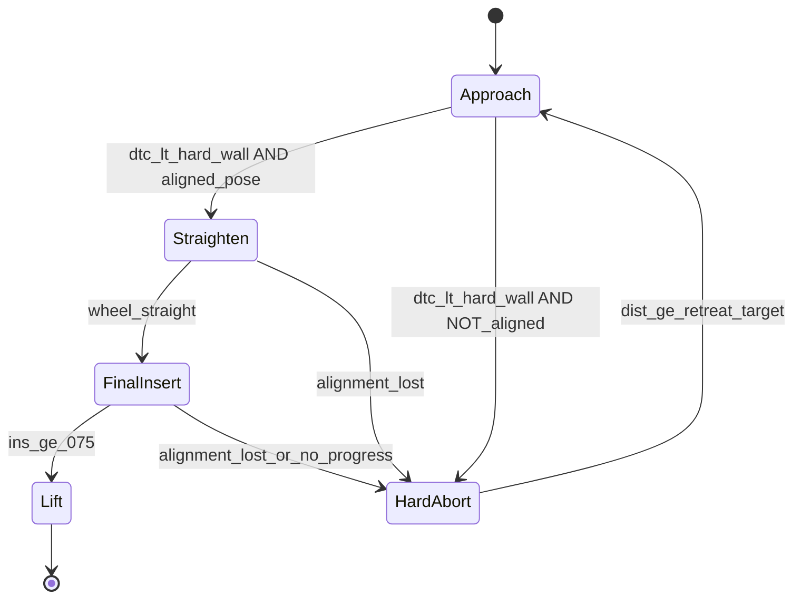

# Expert Policy v7: 几何跟踪控制器 + 四阶段 FSM

> v2 — 整合 feedback_v1 + feedback_v2 的全部修正
>
> 基于 v6 总结、v6 反馈、v7 plan feedback v1/v2，以"先恢复可收敛性，再谈安全外壳"为核心原则，
> 用 Stanley 几何跟踪控制器（含单位缩放）替换 PD、引入四阶段互斥 FSM（含 Straighten 子阶段）、
> Smart Retreat 主动纠偏、insert_norm 进度检测，从根源解决漂移链条问题。

## 核心设计原则

- **"先恢复可收敛性，再谈安全外壳"** — v6 的教训是"四重保护叠加磨没了推进能力"
- **阶段化、互斥化** — 用 FSM 硬阶段替代多层软降速的叠乘
- **修正物理认知** — "降速 != 转弯更紧"（转弯半径 R = L/tan(delta)，与速度无关；速度影响的是偏航角速度 dpsi = v*tan(delta)/L，降速 = 转得更慢而非更紧；降速的价值仅在于降低接触能量）
- **几何跟踪替代线性 PD** — Stanley 控制器更自然处理 Ackermann 的 lat-yaw 耦合
- **严进宽出 + 状态锁定** — FSM 阶段切换需要迟滞区间，防止物理引擎微抖导致状态频闪

## 基线

从 **v5-BC (master @ `c59e4ba`)** 出发，**不继承 v6 的任何代码**。仅保留 v6 诊断中的概念：
- `dist_to_contact = max(dist_front - fork_length, 0)` 作为 FSM 阶段切换的依据
- `fork_length = 1.87m` 几何常量
- `lat_true`（v5-A 已有）

## 架构总览



四阶段互斥 FSM（Approach / Straighten / Final Insert / Hard Abort），**无重叠软约束**:
- **Approach**: 远距修正 — Stanley 控制器全速纠偏；dtc < pre_insert(0.5m) 时收紧对齐要求但仍允许纠偏
- **Straighten**: 近距已对齐但轮未回正 — drive 极低/0，仅让 steer 收敛至 0
- **Final Insert**: 近距已对齐且轮已回正 — steer=0（彻底致盲），恒定推力直线插入
- **Hard Abort**: 近距未对齐 — 果断后退 + Smart Retreat 主动纠偏（**必须在 v7-A 中实现**）

---

## v7-A: Stanley 控制器 + FSM + Smart Retreat（核心变更）

### A1. Stanley 转向律（替换 PD）

当前 v5-BC PD 控制器 (`expert_policy.py` L362-363):

```python
raw_steer = -(cfg.k_lat * lat + cfg.k_yaw * yaw + cfg.k_damp * yaw_rate)
```

替换为 Stanley 控制器（含单位缩放）:

```python
# Stanley steering law (outputs radians)
effective_v = max(abs(v_forward), 0.2)  # floor: prevent noise divergence at low speed
crosstrack_term = math.atan2(k_e * lat, effective_v + k_soft)
delta_rad = yaw + crosstrack_term + k_damp * yaw_rate

# Convert radians -> normalized steer command [-1, 1]
# env multiplies action by steer_angle_rad(0.6), so k_steer = 1/0.6 = 1.667
raw_steer = clip(-delta_rad * k_steer, -max_steer, +max_steer)
```

**关键修正（来自 feedback_v2 Pit A）:**
- Stanley 算出的是弧度，但 env 需要归一化 `[-1,1]`（env 内部再乘 `steer_angle_rad=0.6`）
- 必须显式 `k_steer = 1.0 / steer_angle_rad` 做单位转换，否则控制力度不可预测
- `effective_v = max(abs(v_forward), 0.2)` 防止物理引擎速度噪声导致方向盘高频抽搐（feedback_v1 第 4 点）

**核心优势:**
- `atan2` 对大 lat 天然饱和 — 不会因为 lat=0.5m 就把 steer 拉爆，消除漂移链条的第 1 步
- yaw 和 lat 的平衡由几何决定，不是人工 k_lat/k_yaw 比值
- 速度自适应: `effective_v` 大时 crosstrack 修正柔和，小时更果断（正确的物理关系）
- 所有调参在"物理弧度"空间进行，再统一缩放到归一化空间

**参数:**
- `k_e`: 横向增益 (~2.0-4.0)，起始建议 3.0
- `k_soft`: 低速保护项 (~0.3-0.5)，建议 0.4
- `k_damp`: yaw rate 阻尼 (~0.15-0.25)，建议 0.20
- `k_steer`: 弧度到归一化缩放 = 1.0 / 0.6 = 1.667（或作为可调参）

### A2. 四阶段 FSM

在 `act()` 中引入阶段判定，**替代**当前 v5-BC 的 lift/retreat/insertion/docking 四阶段:

**距离阈值（双阈值设计，来自 feedback_v2 Pit C）:**
- `dtc = max(dist_front - fork_length, 0.0)`
- `pre_insert = 0.5m` — 开始收紧对齐要求，但 Approach 控制器仍可纠偏
- `hard_wall = 0.2m` — 真正的阶段切换硬墙（dtc < hard_wall 才执行 Straighten/FinalInsert/Abort）

**对齐阈值（严进宽出，来自 feedback_v1 第 3 点）:**
- 进入 Final Insert: `final_lat_ok = 0.08m`, `final_yaw_ok = 5deg`（宁缺毋滥）
- 流产触发: `abort_lat = 0.15m`, `abort_yaw = 10deg`（放宽，避免频闪）
- 轮回正门槛: `steer_straight_ok = 0.05`（|prev_steer| 小于此值才算回正）

**状态锁定（来自 feedback_v1 第 3 点）:**
- 用 `self._fsm_stage` 状态变量显式锁定当前阶段
- Hard Abort 一旦进入，无视 dtc 后续变化，直到 `dist_front > retreat_target_dist` 才重置为 Approach
- 防止物理引擎微弹导致每帧在 FinalInsert/HardAbort 间鬼畜抽搐

**Approach 阶段 (dtc > hard_wall 或 dist_front > retreat_target_dist 刚退出 abort):**
- Stanley 控制器，全 steer 权限 (max_steer = 0.80)
- 速度: `v = clip(k_dist * dist_front, v_min, v_max)` — 保持高速
- 当 dtc < pre_insert(0.5m) 时：仍在 Approach 但对齐要求收紧（相当于 v6 的"近区"但不限速）
- 不触发 retreat（远距有足够空间纠偏）

**Straighten 阶段 (dtc <= hard_wall AND aligned_pose AND NOT wheel_straight):**
- `drive = 0.0`（或极低 0.05），仅让 steer 通过 rate limit 自然收敛到 0
- 通常只持续几步（steer rate limit = 0.35，几步即可回正）
- 一旦 `|prev_steer| < steer_straight_ok` → 切入 Final Insert
- 若 alignment 丢失 → 切入 Hard Abort
- **来自 feedback_v2 Pit B**：防止"带弧线冲进去扫托盘"

**Final Insert 阶段 (dtc <= hard_wall AND aligned_pose AND wheel_straight):**
- **steer 彻底致盲**: `raw_steer = -(k_damp * yaw_rate)`，或直接 `raw_steer = 0.0`
  （来自 feedback_v1 第 1 点：后轮转向叉车在近距任何转向都会导致 fork tip 杠杆效应横摆）
- 恒定推力直线插入: `drive = 0.50`
- **insert_norm 进度检测**（来自 feedback_v2 机制 1）:
  - 持续 N 步 (15-25) drive>0 但 insert_norm 增量 < 0.01 → 判定"闷推" → Hard Abort
  - 替代缺失的 contact/slip 传感器
- 若 `|lat| > abort_lat` 或 `|yaw| > abort_yaw` → Hard Abort

**Hard Abort (dtc <= hard_wall AND NOT aligned，或 alignment lost，或 no_progress):**
- **必须在 v7-A 中包含 Smart Retreat**（来自 feedback_v1 第 2 点：盲退保留横向误差 → 无限循环）
- 果断后退: `drive = -1.0`
- **倒车主动纠偏**:

```python
raw_steer = clip(k_lat_rev * lat + k_yaw_rev * yaw, -0.8, 0.8)
```

- **倒车 steer 极性约定（TDD 关键点）:**
  - 现有 v5-BC retreat 已验证：`drive=-1.0` 时 `lat>0 → steer>0` 可以正确纠偏（`test_case_1` 覆盖）
  - 因此 `k_lat_rev` 必须为**正值**（与前进时 `k_lat` 同号）
  - `k_yaw_rev` 同理为**正值**（`yaw>0` 时正 steer 修正偏航）
  - **实现前必须先写 `test_reverse_steer_polarity` 测试，用写死的符号断言**，不允许相对比较
  - 若底层 action space 定义变更导致极性翻转，测试必须第一时间 FAIL

- 状态锁定：进入后无视 dtc，直到 `dist_front > retreat_target_dist (2.5m)`
- 退出条件：距离达标 + 可选对齐质量检查
- cooldown 80 步防止快速循环

### A3. 移除的 v5-BC 遗留机制

- 移除: near-distance gain decay — Stanley 的 atan2 天然处理
- 移除: distance-adaptive steer limit interpolation — FSM 阶段内用固定值
- 保留: steer rate limit (smoothness)
- 保留: throttle rate limit
- 保留: lat-dependent steer bonus（仅 Approach 阶段，可选）

### A4. 不做的事（v6 教训）

- **不加 anti-saturation speed control** — 降速不能"转更紧"，只延长饱和时间
- **不加 yaw-priority** — 在低速+近距组合下会压缩横向收敛域
- **不加 soft alignment gate** — 用 FSM Hard Abort 替代（更果断，不磨蹭）
- **不加 fork-proximity gradual slowdown** — Approach 阶段保持高速；Final 阶段已锁方向

### A5. info 字段输出（来自 feedback_v2 机制 2）

在 `info` dict 中记录，便于数据清洗和归因：
- `fsm_stage`: Approach / Straighten / FinalInsert / HardAbort / Lift
- `delta_rad`: Stanley 算出的原始弧度值
- `crosstrack_term`: atan2 横向修正项
- `steer_sat_ratio`: |raw_steer| / max_steer
- `abort_reason`: pose_not_aligned / wheel_not_straight / no_progress / alignment_lost

---

## BC 数据采集策略（来自 feedback_v1 战略视角）

含 retreat 的轨迹对 BC 是"剧毒"的（因果混淆）。采集数据时建议：
- 一旦 FSM 切入 Hard Abort → `info['terminate'] = True`，强杀当前回合，丢弃轨迹
- 让 Stanley + FSM 疯狂采样，自然淘汰留下"一杆进洞"的黄金轨迹
- 但保留少量"纠偏子数据集"（轻微偏差下的恢复动作），防止 BC 分布过窄导致脆性

---

## 实施计划

### MAE 顺序（来自 feedback_v2 第 4 节，增强归因）

- **A0**: FSM（四阶段）+ **旧 PD** 控制器 — 隔离 FSM 结构本身的收益/损失
- **A1**: FSM + **Stanley**（含 k_steer 单位缩放、v_forward 防抖）— 验证控制器是否减少 steer_sat
- **A2**: A1 + **Straighten 子阶段** + **insert_norm 进度检测** — 打掉"最后半米扫托盘"和"闷推"

### 分支

- 从 `master` (`c59e4ba`) 新建 `exp/expert-v7`

### 修改文件

- `forklift_expert_policy_project/forklift_expert/expert_policy.py`:
  - `ExpertConfig`: 新增 Stanley 参数 (`k_e`, `k_soft`, `k_steer`)，FSM 参数 (`fork_length`, `pre_insert`, `hard_wall`, `final_lat_ok`, `final_yaw_ok`, `abort_lat`, `abort_yaw`, `steer_straight_ok`)，进度检测参数 (`no_progress_steps`, `no_progress_eps`)，倒车纠偏参数 (`k_lat_rev`, `k_yaw_rev`)
  - `_decode_obs()`: 新增 `dist_to_contact` 返回
  - `act()`: 替换 PD 为 Stanley；替换四阶段为新 FSM；新增 `self._fsm_stage` 状态锁定
- `forklift_expert_policy_project/tests/test_retreat_logic.py`: 更新/新增测试用例
  - **TDD 首写**: `test_reverse_steer_polarity` — 写死符号断言，实现前必须先写此测试:

```python
def test_reverse_steer_polarity():
    """HardAbort 倒车纠偏: lat>0 → steer>0, lat<0 → steer<0（写死断言）。
    依据: v5-BC retreat 已验证 drive=-1 + steer=sign(lat) 可正确纠偏。"""
    # Case A: 车在右侧(lat>0)，平行(yaw=0)，HardAbort 阶段
    policy = _make_policy()
    obs_right = _make_obs_for_lat(lat_desired=0.5, dist_front=fork_length + 0.1)
    policy._fsm_stage = "HardAbort"
    _, info = policy.act(obs_right)
    assert info["fsm_stage"] == "HardAbort"
    assert info["raw_steer"] > 0, f"lat>0 倒车应 steer>0, got {info['raw_steer']:.3f}"

    # Case B: 车在左侧(lat<0)
    policy2 = _make_policy()
    obs_left = _make_obs_for_lat(lat_desired=-0.5, dist_front=fork_length + 0.1)
    policy2._fsm_stage = "HardAbort"
    _, info2 = policy2.act(obs_left)
    assert info2["fsm_stage"] == "HardAbort"
    assert info2["raw_steer"] < 0, f"lat<0 倒车应 steer<0, got {info2['raw_steer']:.3f}"
```

  - 新增: Stanley 转向方向/饱和/单位缩放测试
  - 新增: FSM 阶段切换 + 迟滞测试（含状态锁定验证）
  - 新增: Straighten 轮回正测试
  - 新增: insert_norm 进度检测测试
  - 保留: retreat 相关测试（更新阈值）

### 验证步骤

1. 单元测试: 全部 pass
2. Smoke test (每个 MAE 阶段): 3 seed x 5 ep, 重点指标:
   - avg max ins 是否回升到 v5-BC 水平 (>0.25)
   - retreat 占比是否降低 (<30%)
   - steer_sat 时间占比、yaw_diverge 频率
   - no_progress abort 频率（新增）
3. 对比 v5-BC baseline 和各 MAE 阶段的同 seed 轨迹

### 评估指标（沿用 v6 报告体系 + 新增）

- steer_sat 时间占比
- yaw_diverge 频率
- avg max_ins
- ins>=0.1 / ins>=0.5 / ins>=0.75
- retreat 步数占比
- no_progress abort 频率（新增）
- FSM 阶段分布（新增）
