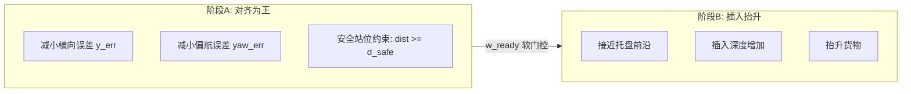

# 奖励函数 S0 极简两阶段优化方案

> 将现有 v4 两阶段硬切换奖励函数重构为 S0 极简软门控方案，实现"对齐优先 + 安全站位 + 再插入抬升"的行为引导，解决当前策略"在托盘前反复蹭"的焦虑型叉车问题。

---

## 问题诊断

从训练日志 `train_reward_v42_phase_v4.log` 可见:
- `phase/frac_phase1: 0.0000` - 策略从未进入 Phase1
- `err/dist_x_mean: 1.4m` - 长期停在远处
- `err/insert_norm_mean: 0.0` - 插入深度始终为 0
- `phase/frac_stall: 26%` - 四分之一时间在摸鱼

**根因**: v4 把"接近"和"对齐"绑太紧，phase 切换条件 `(dist<0.8m && lat<0.1m && yaw<10°)` 要求同时满足，导致策略学成"又要近又要准"的焦虑型叉车。

---

## 方案 S0 核心思想



- **不用 phase 状态机**, 用两个软门控权重 `w_ready` 和 `w_lift` 实现自然过渡
- **阶段 A 核心 KPI**: `E_align = |y_err|/lat_ready + yaw_deg/yaw_ready`
- **阶段 B 启动条件**: `w_ready = w_lat * w_yaw` 接近 1 时才给接近/插入奖励

---

## 实现细节（已完成）

### 1. 配置文件 `env_cfg.py`

```python
# ========== S0 极简两阶段奖励参数 ==========
# --- S0 阶段阈值（用于软门控计算） ---
lat_ready_m: float = 0.10              # 对齐就绪横向阈值（m）
yaw_ready_deg: float = 10.0            # 对齐就绪偏航阈值（度）
d_safe_m: float = 0.70                 # 安全站位距离（m）
insert_gate_norm: float = 0.60         # 抬升门槛插入深度（归一化）
insert_ramp_norm: float = 0.10         # 抬升权重线性区间

# --- S0 奖励系数（全部用增量，防站桩刷分） ---
k_align: float = 1.0                   # 对齐进步奖励
k_approach: float = 3.0                # 接近奖励（对齐好了才给）
k_insert: float = 10.0                 # 插入进度奖励
k_lift: float = 20.0                   # 抬升奖励
k_close: float = 2.0                   # 没对齐就贴脸惩罚
k_wrongins: float = 6.0                # 未对齐插入惩罚（防斜怼）

# --- 终点奖励 ---
rew_success: float = 100.0             # 成功基础奖励
rew_success_time: float = 30.0         # 时间奖金
```

### 2. 环境文件 `env.py` 核心逻辑

#### 2.1 缓存变量

```python
# S0 新增缓存：用于增量型奖励计算
self._last_E_align = torch.zeros((self.num_envs,), device=self.device)
self._last_dist_front = torch.zeros((self.num_envs,), device=self.device)
self._last_lift_pos = torch.zeros((self.num_envs,), device=self.device)
```

#### 2.2 软门控权重计算

```python
# w_ready：对齐就绪权重（阶段 A → 阶段 B 的软开关）
w_lat = torch.clamp(1.0 - y_err / self.cfg.lat_ready_m, min=0.0, max=1.0)
w_yaw = torch.clamp(1.0 - yaw_err_deg / self.cfg.yaw_ready_deg, min=0.0, max=1.0)
w_ready = w_lat * w_yaw  # 很歪/很偏：≈0；对齐好：→1

# w_lift：抬升权重（插够深再抬）
w_lift = torch.clamp(
    (insert_norm - self.cfg.insert_gate_norm) / self.cfg.insert_ramp_norm,
    min=0.0, max=1.0
)
```

#### 2.3 奖励项（全部用增量）

```python
# 对齐进步奖励（阶段 A 核心）
r_align = self.cfg.k_align * (self._last_E_align - E_align)

# 安全距离惩罚（没对齐别贴脸）
pen_close = -self.cfg.k_close * (1.0 - w_ready) * torch.relu(self.cfg.d_safe_m - dist_front)

# 接近奖励（对齐好了才给）
r_approach = self.cfg.k_approach * w_ready * torch.clamp(delta_dist, min=-0.05, max=0.05)

# 插入进度奖励（对齐好了才给，加 clip 防跳变）
r_insert = self.cfg.k_insert * w_ready * torch.clamp(delta_insert, min=-0.03, max=0.03)

# 未对齐插入惩罚（防斜怼）
pen_wrong_insert = -self.cfg.k_wrongins * (1.0 - w_ready) * torch.relu(delta_insert)

# 抬升奖励（插够深才给）
r_lift = self.cfg.k_lift * w_lift * delta_lift

# 成功奖励（用张量乘法，不用 if）
rew = rew + success.float() * (self.cfg.rew_success + time_bonus)
```

#### 2.4 Reset 时缓存初始化

```python
# 用当前状态计算初始值（保证首步 delta 不炸）
E_align = y_err / self.cfg.lat_ready_m + yaw_err_deg / self.cfg.yaw_ready_deg
self._last_E_align[env_ids] = E_align[env_ids]
self._last_dist_front[env_ids] = dist_front[env_ids]
self._last_lift_pos[env_ids] = self._joint_pos[env_ids, self._lift_id]
```

---

## 关键工程细节

### 1. dist_front 符号处理

```python
# 防止 dist_front 变负导致反向刷分
dist_front = torch.clamp(self._pallet_front_x - tip[:, 0], min=0.0)
```

### 2. 向量化成功奖励

```python
# 正确写法：用张量乘法，不用 if success:
rew = rew + success.float() * success_total
```

### 3. 坐标系一致性

- `tip[:, 0]` 是 world 坐标系下的 x 坐标
- `self._pallet_front_x` 也是 world 坐标系
- 两者直接相减是安全的

### 4. 首步保护

```python
# 首步不给增量奖励（避免初始化跳变）
r_align = torch.where(self._is_first_step, torch.zeros_like(r_align), r_align)
```

---

## 日志输出（TensorBoard）

```python
# S0 核心指标
self.extras["log"]["s0/E_align_mean"] = E_align.mean()
self.extras["log"]["s0/w_ready_mean"] = w_ready.mean()
self.extras["log"]["s0/w_lift_mean"] = w_lift.mean()
self.extras["log"]["s0/dist_front_mean"] = dist_front.mean()

# 奖励分量
self.extras["log"]["rew/r_align"] = r_align.mean()
self.extras["log"]["rew/pen_close"] = pen_close.mean()
self.extras["log"]["rew/r_approach"] = r_approach.mean()
self.extras["log"]["rew/r_insert"] = r_insert.mean()
self.extras["log"]["rew/pen_wrong_insert"] = pen_wrong_insert.mean()
self.extras["log"]["rew/r_lift"] = r_lift.mean()
```

---

## 参数初始值

| 参数 | 值 | 含义 |
|------|-----|------|
| `lat_ready_m` | 0.10 | 对齐横向阈值 |
| `yaw_ready_deg` | 10.0 | 对齐偏航阈值 |
| `d_safe_m` | 0.70 | 安全站位距离 |
| `k_align` | 1.0 | 对齐奖励系数 |
| `k_approach` | 3.0 | 接近奖励系数 |
| `k_insert` | 10.0 | 插入奖励系数 |
| `k_lift` | 20.0 | 抬升奖励系数 |
| `k_close` | 2.0 | 贴脸惩罚系数 |
| `k_wrongins` | 6.0 | 斜怼惩罚系数 |
| `rew_success` | 100.0 | 成功基础奖励 |
| `rew_success_time` | 30.0 | 时间奖金 |

---

## 实施状态

- [x] 更新 env_cfg.py: 添加 S0 奖励参数
- [x] 更新 env.py __init__: 添加缓存变量
- [x] 重写 env.py _get_rewards(): 实现 S0 软门控奖励逻辑
- [x] 更新 env.py _reset_idx(): 用当前状态初始化缓存
- [x] 添加奖励分量日志输出

---

*文档版本：S0 (已实现)*
*更新日期：2026-02-03*
